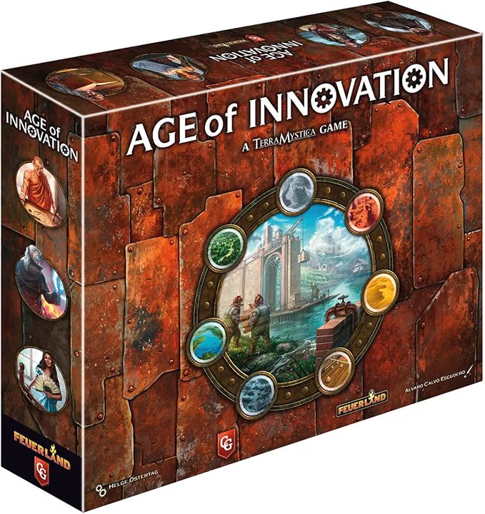

# Age of Innovation

*Age of Innovation* is a strategic civilization-building game set in the universe of *Terra Mystica*. Players lead unique factions, transform the landscape, expand their territories, develop technologies, and build an increasingly powerful society. Careful planning and adaptation are essential, since the best actions depend on the terrain, faction abilities, and the changing opportunities on the map.
