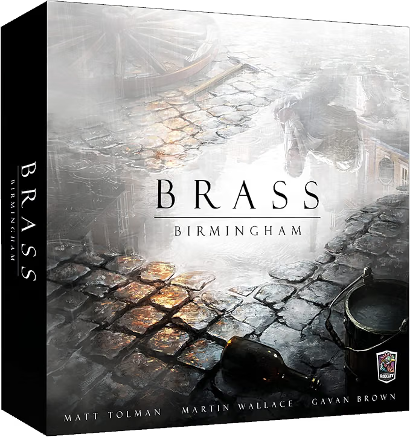

# Brass: Birmingham

*Brass: Birmingham* is an economic strategy game set in England during the Industrial Revolution. Players compete as entrepreneurs developing industries, building canals and railways, and establishing trade networks across the region. The game is played over two eras, and success depends on managing a tight economy, timing developments carefully, and taking advantage of shared infrastructure and market demand.

## Rules

- [Official rulebook (French)](rules/Brass-Birmingham-Rulebook-FR-2018.07.11.pdf)
- [Variant: Canal to shared rail with boat maintenance](rules/variant-canal-rail-partage.md)
